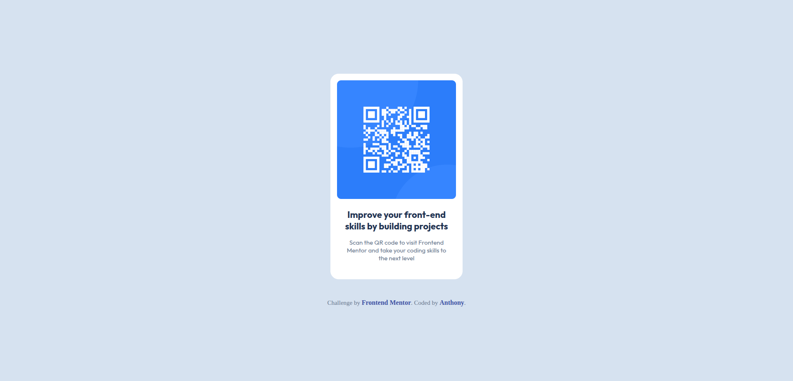

# Frontend Mentor – QR code component solution

This is my solution to the [QR code component challenge](https://www.frontendmentor.io/challenges/qr-code-component-iux_sIO_H) on Frontend Mentor.  
Frontend Mentor challenges help improve front-end skills by building small, realistic projects.

---

## Overview

### Screenshot

### Links

- Solution URL: https://www.frontendmentor.io/solutions/qr-code-component-solution
- Live Site URL: https://wizkid0107.github.io/FEM-QR-code-component/

---

## My process

### Built with

- Semantic HTML5
- CSS
- Flexbox
- Mobile-first workflow

---

### What I learned

While working on this project, I ran into a couple of issues that helped me better understand CSS layout behavior.

The first issue was spacing between the QR code image and the text. I initially tried adding margins to the individual elements, but the spacing wasn’t behaving as expected. I eventually realized that since both elements were children of the same parent container, the correct solution was to apply a gap property to the parent container instead. This reinforced the idea that spacing is often best handled at the layout level.

The second issue was centering the main container on the page. Even though I was using a universal browser reset, the layout was still slightly off-center. I learned that browsers apply a default margin to the body element, so I needed to explicitly set margin: 0 on the body before using Flexbox to properly center the container.

---

### Continued development

In future projects, I want to continue improving my CSS layout skills, especially with Flexbox and responsive design. I also plan to complete more Frontend Mentor challenges to strengthen my understanding of front-end fundamentals.

---

### Useful resources

- [MDN Web Docs](https://developer.mozilla.org/) – Helped me better understand HTML and CSS behavior
- [CSS-Tricks Flexbox Guide](https://css-tricks.com/snippets/css/a-guide-to-flexbox/) – Useful reference for Flexbox layouts

---

## Author

- Frontend Mentor: https://www.frontendmentor.io/profile/WizKid0107
- GitHub: https://github.com/WizKid0107

---

## Acknowledgments

Thanks to Frontend Mentor for providing the challenge and design.
